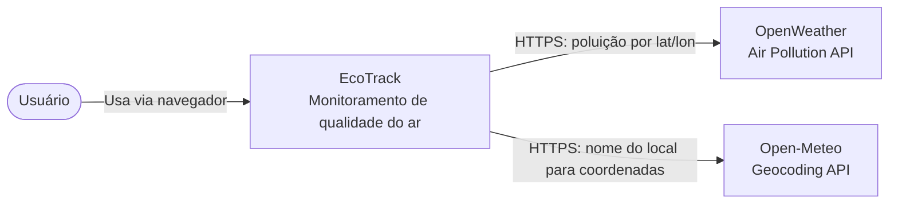
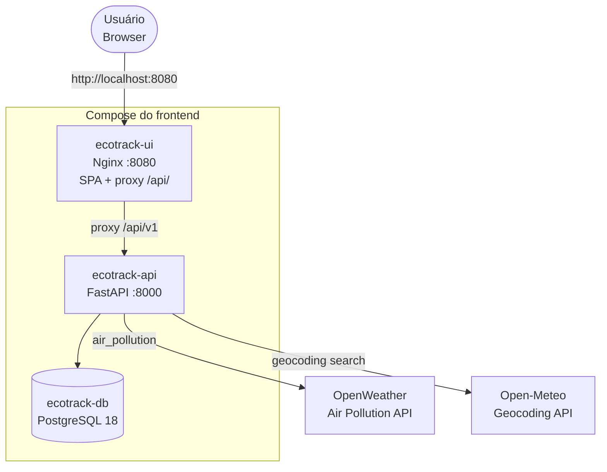

# EcoTrack Frontend

Interface do **EcoTrack** — monitoramento de qualidade do ar (PM2.5, PM10, CO, NO₂, O₃). O usuário consulta a leitura de um alerta no dashboard e gerencia alertas georreferenciados (criar, editar, excluir, filtrar e paginar).

O browser fala somente com esta aplicação. Qualidade do ar e geocodificação passam pela API em `ecotrack-backend`. Nenhuma chamada sai do navegador para a OpenWeather ou para a Open-Meteo, e nenhuma chave de API fica neste repositório.

## Stack

| Camada    | Tecnologia                                      |
| --------- | ----------------------------------------------- |
| UI        | Vue 3, Vite 8, Tailwind CSS 4, JavaScript       |
| Gráfico   | Chart.js 4 + vue-chartjs                        |
| HTTP      | Axios (`VITE_API_BASE_URL`, default `/api/v1`)  |
| Entrega   | Nginx (fallback de SPA + proxy `/api/`)         |

## Pré-requisitos

- Node.js 22+
- Docker Engine (ou Docker Desktop) com Compose, para a stack completa
- Repositório irmão `ecotrack-backend` ao lado deste (`../ecotrack-backend`)
- Chave OpenWeather no `.env` **do backend**, não neste repo

## Instalação e desenvolvimento

```bash
cp .env.example .env
npm install
npm run dev
```

A UI sobe em http://localhost:5173. O Vite encaminha `/api` para `http://127.0.0.1:8000`, então a API precisa estar no ar (compose do backend, ou só `ecotrack-db` + `ecotrack-api`).

| Comando            | Uso                          |
| ------------------ | ---------------------------- |
| `npm run dev`      | Servidor de desenvolvimento  |
| `npm run build`    | Build de produção em `dist/` |
| `npm run preview`  | Serve o `dist/` localmente   |
| `npm run lint`     | ESLint                       |
| `npm run format`   | Prettier                     |

`VITE_API_BASE_URL` é embutida no build. Em desenvolvimento e no container o valor é `/api/v1` (same-origin). Não use `http://localhost:8000` na imagem Nginx.

## Docker Compose (stack completa)

Este compose sobe os três serviços: `ecotrack-db`, `ecotrack-api` e `ecotrack-ui`. O build da API usa `../ecotrack-backend`. A chave `OPENWEATHER_API_KEY` é lida de `../ecotrack-backend/.env` e não é copiada para cá.

```bash
# no ecotrack-backend, uma vez:
cp .env.example .env
# defina OPENWEATHER_API_KEY nesse arquivo

# na raiz deste repositório:
docker compose up --build
```

- UI: http://localhost:8080
- Alertas (rota do SPA, sem 404 do Nginx): http://localhost:8080/alerts
- API via proxy: http://localhost:8080/api/v1/alerts
- API direta: http://localhost:8000/docs
- PostgreSQL: `localhost:5432` (usuário, senha e banco: `ecotrack`)

Não suba este compose junto com o do backend. Os dois publicam as portas **5432** e **8000** e usam os mesmos `container_name`. O caminho completo é só este arquivo, com os repositórios irmãos.

## Rotas consumidas

Todas relativas a `/api/v1`. No container, o Nginx preserva esse prefixo ao encaminhar para `ecotrack-api:8000`.

| Método   | Rota                    | Uso na interface                          |
| -------- | ----------------------- | ----------------------------------------- |
| `GET`    | `/alerts`               | Lista, filtro de criticidade e paginação  |
| `POST`   | `/alerts`               | Criar alerta                              |
| `PUT`    | `/alerts/{id}`          | Editar alerta (parcial)                   |
| `DELETE` | `/alerts/{id}`          | Excluir alerta (204, sem corpo)           |
| `GET`    | `/air-quality`          | Card e gráfico do dashboard               |
| `GET`    | `/geocode`              | Busca de local no formulário de alerta    |

## APIs externas

O browser não chama estas APIs. Quem chama é o backend.

### OpenWeather Air Pollution

| Item               | Detalhe                                                                                                                     |
| ------------------ | --------------------------------------------------------------------------------------------------------------------------- |
| **Cadastro**       | https://openweathermap.org/api — conta gratuita; a chave fica em `ecotrack-backend/.env`                                    |
| **Rota (backend)** | `GET https://api.openweathermap.org/data/2.5/air_pollution?lat={lat}&lon={lon}&appid={key}`                                 |
| **Licença / uso**  | Plano gratuito de uso não comercial; [termos da OpenWeather](https://openweathermap.org/terms). Limite de 60 req/min na rota `/air-quality` |

### Open-Meteo Geocoding

| Item               | Detalhe                                                                                                      |
| ------------------ | ------------------------------------------------------------------------------------------------------------ |
| **Cadastro**       | Não precisa de chave                                                                                         |
| **Rota (backend)** | `GET https://geocoding-api.open-meteo.com/v1/search?name={q}&count={limit}`                                  |
| **Licença / uso**  | [CC BY 4.0](https://creativecommons.org/licenses/by/4.0/) — uso não comercial                                 |

## Arquitetura (C4)

### Contexto



### Containers



Em `npm run dev`, o browser usa o Vite na porta 5173 no lugar do Nginx. O destino das rotas `/api/v1` continua sendo a API; OpenWeather e Open-Meteo seguem só no backend.
